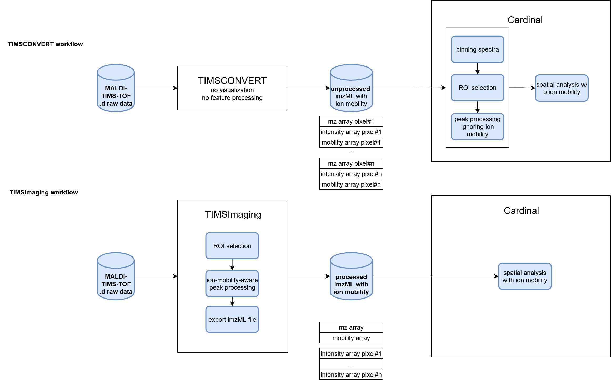

## Introduction

In this part, we compare TIMSImaging workflow with existing method that ignores ion mobility on the same mosue kidney peptide dataset. TIMSCONVERT is an open-source tool to convert general Bruker raw data into open formats, users could install from https://github.com/gtluu/timsconvert. Specifically, it outputs imzML for MALDI-TIMS-MS imaging data, either with ion mobility or not. However, it does **NOT** do any pre-processing. 

### Convert raw data using TIMSCONVERT
First we run the shell script below to convert the raw dataset into **unprocessed** imzML using TIMSCONVERT. Note that unprocessed imzML of TIMS-on dataset is usually huge, we recommmend to do the conversion on HPC.
```{shell}
#| eval: false
#| echo: true
#| warning: false
#| message: false
#| collapse: true

#!/bin/bash
#SBATCH --nodes=1
#SBATCH --time=4:00:00
#SBATCH --job-name=Casestudy_timsconvert
#SBATCH --mem=80G
#SBATCH --partition=short
#SBATCH -o output_%j.txt                    # Standard output file
#SBATCH -e error_%j.txt                     # Standard error file
#SBATCH --mail-user=zhu.yiny@northeastern.edu  # Email
#SBATCH --mail-type=ALL                     # Type of email notifications
eval "$(conda shell.bash hook)"
conda activate timsconvert
cd /work/VitekLab/Data/MS/Melanie_manuscript/
timsconvert --input Kidney_MS1_ITO6.d --outdir mouse_kidney_timsconvert_output --compression none --mode centroid --verbose
conda deactivate
```

### Process data from TIMSCONVERT

```{r setup, include=FALSE}
library("Cardinal")
```

Load the imzML data from TIMSCONVERT:

```{r data import}
msa <- readMSIData("D:\\dataset\\Melanie_case_study\\Kidney_MS1_ITO6.imzML")
msa
```

TIMSCONVERT keeped the ion mobility array in the imzML data, however the peak processing functions in Cardinal cannot take advantage of it. When loaded into `MSImageExperiment`, the ion mobility array is discarded, and data points with the same m/z but different ion mobilities can no longer be distinguished, but they are still separate entries. Here we bin the spectra to project isobaric data points together, then do processing **without** ion mobility in Cardinal.

```{r}
mse_binned <- bin(msa, resolution=20, units="ppm")
mse<-summarizePixels(mse_binned)
```

To reduce the computation, we only process the kidney tissue region in following steps.

```{r}
kidney <- subsetPixels(mse, x<500)
image(kidney, 'tic')
```

Plot one spectrum, though a single spectrum is centroided on m/z dimension by the instrument, it looks more similar with a profile spectrum after projection.

```{r unprocessed spectra visualization}
plot(kidney, i=1234)
```

Treat the data as profile spectra and process it to reduce the number of features.

```{r peak processing}
kidney <- subsetPixels(mse_binned, x<500)
centroided(kidney)<-FALSE
set.seed(1, kind="L'Ecuyer-CMRG")
#kidney <- normalize(kidney, method='rms')
peaks <- peakProcess(kidney, SNR=3, tolerance=200, units="ppm")
```

### Comparing ion images with/without ion mobility

Then we load the processed data from TIMSImaging, which is already peak-picked.

```{r TIMSImaging data}
peaks_timsimaging <- readMSIData("D:\\dataset\\Melanie_case_study\\mouse_kidney.imzML")
peaks_timsimaging
```

Normalize on peak-picked data for fair comparison:

```{r normalization}
peaks_norm = process(normalize(peaks, method='tic'))
peaks_timsimaging <- process(normalize(peaks_timsimaging, method='tic'))
```

Plot ion images from processsing with/without ion mobility in the same color scale.

```{r ion image visualization}
m <- 1198.7
image(peaks_timsimaging, i = findInterval(m, mz(peaks_timsimaging))+1, zlim=c(0, 5))
image(peaks_norm, mz = m, zlim=c(0, 5))
```

The ion images from TIMSCONVERT and processed in Cardinal looks noiser, as well as less contrast between the background and kidney edge.

```{r}
m <- 1443.59
image(peaks_timsimaging, i = findInterval(m, mz(peaks_timsimaging))+1, zlim=c(0, 8))
image(peaks_norm, mz = m, zlim=c(0, 8))
```
