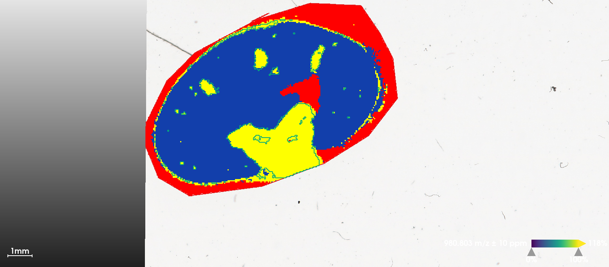

# Introduction

In this case study, we present spatial shrunken centroid segmentation of an imzML file with ion mobility in Cardinal. The dataset is from MALDI-TIMS-TOF imaging of a mouse kidney tissue, pre-processed and exported from TIMSImaging. The dataset is from Melaine Föll Lab and available at MassIVE.\
Li, M., Meyer, L., Meier, N., Witte, J., Maldacker, M., Seredynska, A., Schueler, J., Schilling, O. and Föll, M. (2025), Spatial Proteomics by Parallel Accumulation-Serial Fragmentation Supported MALDI MS/MS Imaging: A First Glance Into Multiplexed and Spatial Peptide Identification. Rapid Commun Mass Spectrom, 39: e10006. <https://doi.org/10.1002/rcm.10006>

```{r setup, message=FALSE, warning=FALSE}
library("Cardinal")
```

# Load the dataset

The raw .d dataset is processed by TIMSImaging and exported as continuous, centroided imzML format, that each pixel has a 2D spectrum consisting of mz array, mobility array and intensity array. All spectra share the same mz and mobility array as the file is "continuous".

```{r data import}
msa <- readMSIData('~/Desktop/MSI/TIMSImaging/Bioinfomatics manuscript/Melanie_manuscript_case_study/mouse_kidney.imzML', as="MSImagingArrays", extraArrays=c(mobility="MS:1003006"))
msa
```

The ion mobility information is also imported.

```{r view ion mobility}
spectraData(msa)$mobility
```

# Coerce to MSImagingExperiment

In order to do downstream analysis, we need to convert the MSImagingArray object to MSImagingExperiment(we can also dircetly create MSImagingExperiment from the imzML `mse <- readMSIData('~/Desktop/MSI/Ion mobility/Melanie_manuscript_case_study/PDX.imzML', )`). Unfortunately, currently MSImagingExperiment cannot handle ion mobility and the mobility array would be discarded. However, we can do *spatial analysis* like spatial shrunken centroid anyway as the ion images are distinct.

```{r coercion}
mse <- convertMSImagingArrays2Experiment(msa)
```

# Spatial Shruken Centroids Segmentation

Here we use multivariate spatial shrunken centroids(SSC) to cluster pixels into segments. We use a fixed segment number(k) with different sparsity(s). The larger s is, the more unimportant features would be ignored and not contribute to segmentation.

```{r spatial shrunken centroid}
set.seed(42, kind="L'Ecuyer-CMRG")
ssc <- spatialShrunkenCentroids(mse, r=1, k=3, s=c(0, 6, 12))
ssc
```

We can visualize the segmentation results and compare with the results from vendor's SCiLS Lab software, which uses bisecting K-means. When s=6, SSC results in clear segments for Cortex(1), Medulla(2) and background(3).

```{r ssc image}
image(ssc, i=1:3, type="probability", layout=c(1,3))
```



Visualize statistic profile for each segment. Use the `plot` function to show which mass features are associated with which segments, higher statistics means the feature has more contribution to corresponding segment. Here we visualize top-100 features for each segment.

```{r ssc plot}
plot(ssc, i=1:3, n=100, linewidth=2, layout=c(3,1))
```

# Univariate segmentation on isobaric features

Here we select two features at the same m/z, apply univariate Spatial Dirichlet Gaussian mixture models(DGMM) on them separately, and compare with segmentation that treats them as one feature.\
First plot ion images separately. Note that two features have apexes at the same mass location, but here we use the weighted average m/z to distinguish them in the MSImagingExperiment object.

```{r isomeric features visualization}
i <- findInterval(1105.5, mz(mse))

mobs <- spectraData(msa)$mobility[[1]][c(i+1, i+2)]
img <- image(mse, i=c(i+1, i+2), scale=TRUE)
img$labels <- paste(img$labels, "\n1/K_0 = ", sprintf("%.3f", mobs))
plot(img)
```

Plot ion images collapsing two features(ignore separation by ion mobility)

```{r}
ions <- subsetFeatures(mse, i=c(i+1, i+2))
summed <- bin(ions, resolution=1, units="mz")
image(summed, i=2)
```

DGMM on individual features. Though two features are at the same m/z, i=2(1/K$_0$=1.533) has higher correlation with the sub-structures while i=1 is more uniformly distributed.

```{r}
set.seed(42, kind="L'Ecuyer-CMRG")

dgmm <- spatialDGMM(ions, r=1, k=3, weights="gaussian")
image(dgmm, i=c(1,2), layout=c(1,2))
```

DGMM on collapsed feature Without ion mobility separation, the segmentation result is noisier than using feature(m/z = 1105.5277, 1/K$_0$=1.533) only. Segmentation on ion moblity-resolved data could help filtering features more accurately.

```{r}
dgmm_summed <- spatialDGMM(summed, r=1, k=3, weights="gaussian")
image(dgmm_summed, i=2)
```
