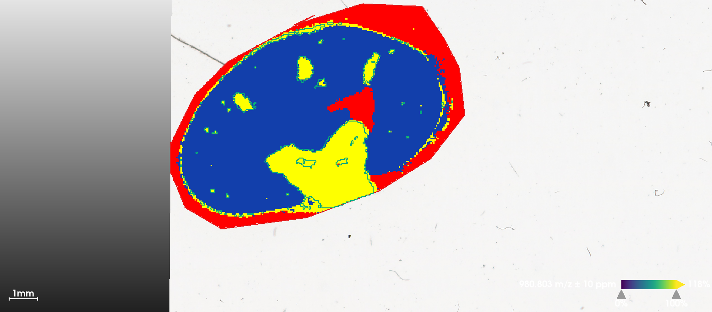

## Introduction

In this part, we start from processed imzML data in Section 2, first show how ion mobility is stored, then perform spatial shrunken centorids to show that it is compatible with Cardinal, and further illustrate benefits of ion moblity by single ion image segmentation.

## Cardinal setup

First make sure Cardinal is installed. If not, run the code below in a R session:

```{r}
#| eval: false
#| echo: true
#| warning: false
#| message: false
#| collapse: true
if (!require("BiocManager", quietly = TRUE))
    install.packages("BiocManager")

BiocManager::install("Cardinal")
```

Then load Cardinal:

```{r}
library("Cardinal")
```

## Load processed dataset

The raw .d dataset was processed by TIMSImaging and exported as continuous, centroided imzML format, that each pixel corresponds to a spectrum with 3 dimensions: mz, mobility and intensity; all spectra share the same mz and mobility domain.\
Here we use `extraArrays` to load ion mobility information, and `MS:1003006` is the entry number for ion mobility.

```{r}
msa <- readMSIData("D:/dataset/Kidney_MS1_ITO6.imzML", as="MSImagingArrays", extraArrays=c(mobility="MS:1003006"))
msa
```

Check that we can access ion mobility now. The mobiity values are in $1/K_0$:

```{r}
spectraData(msa)$mobility
```

## Coerce to MSImagingExperiment

In order to do downstream analysis, we need to convert the MSImagingArray object to MSImagingExperiment. Unfortunately, currently MSImagingExperiment does not support extra arrays and the mobility array would be discarded. However, we can do *spatial analysis* like segmentation anyway as the features are from ion mobility-awere peak picking(after conversion, isobaric ions are still distinct.)

```{r}
mse <- convertMSImagingArrays2Experiment(msa)
```

## Spatial Shruken Centroids Segmentation

Here we use multivariate spatial shrunken centroids(SSC) to cluster pixels into segments. We use a fixed segment number(k) with different sparsity(s). The larger s is, the more unimportant features would be ignored and not contribute to segmentation.

```{r}
set.seed(42, kind="L'Ecuyer-CMRG")
ssc <- spatialShrunkenCentroids(mse, r=1, k=3, s=c(0, 6, 12))
ssc
```

We can visualize the segmentation results and compare with the results from vendor's SCiLS Lab software, which uses bisecting K-means. When s=6, SSC results in clear segments for Cortex(1), Medulla(2) and background(3).

```{r}
image(ssc, i=1:3, type="probability", layout=c(1,3))
```



Visualize statistic profile for each segment. Use the `plot` function to show which mass features are associated with which segments, higher statistics means the feature has more contribution to corresponding segment. Here we visualize top-100 features for each segment.

```{r}
plot(ssc, i=1:3, n=100, linewidth=2, layout=c(3,1))
```

## Univariate segmentation on isobaric features

Here we select two isobaric features, apply univariate Spatial Dirichlet Gaussian mixture models(DGMM) on them separately, and compare with segmentation that treats them as one feature.\
First plot ion images separately. Note that two features have apexes at the same mass location, but here we use the weighted average m/z to distinguish them in the MSImagingExperiment object(see the heatmap in [Section 1](2-mouse_kidney.ipynb#isomer_screenshot_1)).

```{r}
i <- findInterval(1132.4, mz(mse))

mobs <- spectraData(msa)$mobility[[1]][c(i+1, i+2)]
img <- image(mse, i=c(i+1, i+2), scale=TRUE)
# add ion mobility in plot titles
img$labels <- paste(img$labels, "\n1/K_0 = ", sprintf("%.3f", mobs))
plot(img)
```

DGMM on individual features. Though two features are at the same m/z, i=1(1/K$_0$=1.460) has higher correlation with the sub-structures while i=2 is more uniformly distributed.

```{r}
ions <- subsetFeatures(mse, i=c(i+1, i+2))

set.seed(42, kind="L'Ecuyer-CMRG")
dgmm <- spatialDGMM(ions, r=1, k=3, weights="adaptive")
image(dgmm, i=c(1,2), layout=c(1,2))
```

Plot the ion image collapsing two features(ignore separation by ion mobility). Here we use the `bin()` function in Cardinal which sums intensities within 1 Da bin, as there are no other feature in the mass interval.

```{r}
summed <- bin(ions, resolution=1, units="mz")
image(summed, i=1)
```

DGMM on collapsed feature without ion mobility separation, the segmentation result is noisier than using feature(m/z = 1132.4720, 1/K$_0$=1.460) only. DGMM segmentation is usually used to find features whose segments colocalize with certain ROIs, on ion moblity-resolved data could help screening informative features more accurately.

```{r}
dgmm_summed <- spatialDGMM(summed, r=1, k=3, weights="gaussian")
image(dgmm_summed, i=1)
```
